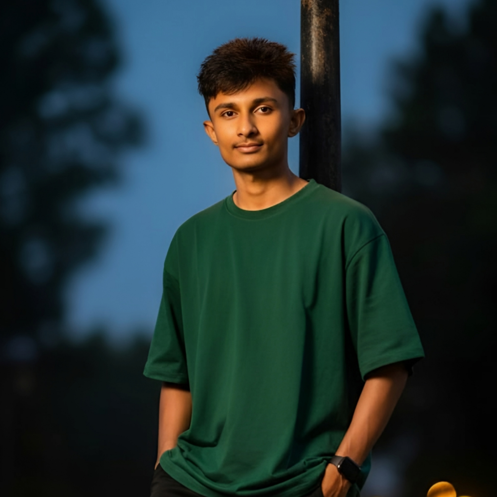

# 👨‍💻 MR NIPUN OFC

  <!-- Static Profile Photo -->
  

  <strong style="font-size:24px;">MR NIPUN OFC / TECH-WEB</strong> 
  
    Full Stack Developer • UI/UX Designer • IoT Enthusiast
  

---

## 💻 I'M MR NIPUN OFC

  

---

## 🧑‍🚀 About Me

Hello! I'm **MR NIPUN**, from Sri Lanka 🇱🇰  
A passionate **Full Stack Developer + UI/UX Designer** creating smooth, fast & animated interfaces.

### 🔥 My Skills  
- Java  
- Python  
- HTML / CSS  
- Next.js  
- Arduino / IoT  
- UI/UX Design  
- Logo & Animation Design  
- Photography  

---

## 📬 Contact Me

- 📞 WhatsApp: **+94757255903**
- 🌍 From : Sri Lanka
- 👨‍💻 Gmail : mrnipunofc@tech.com

---

## 📁 Required Files (IMPORTANT)

Make sure these files exist in your repo:(https://my-web-eight-alpha.vercel.app/)
